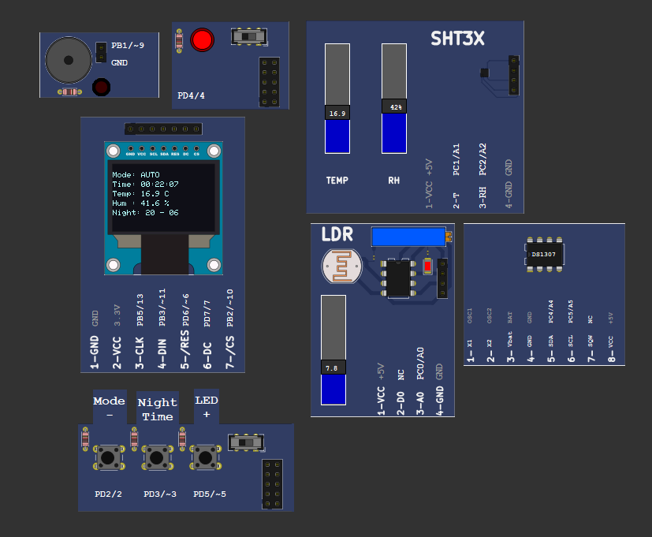
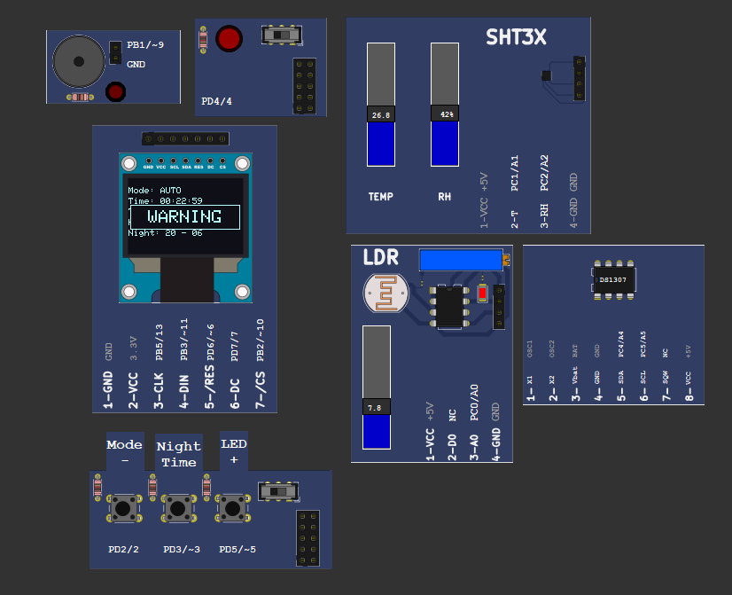
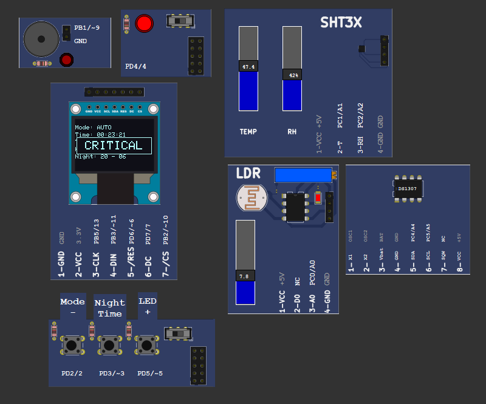
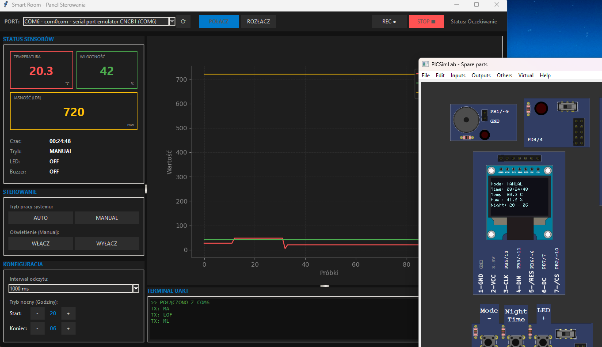

# 🏠 Smart Room

Smart Room is an intelligent room monitoring and automation system based on **Arduino UNO**, designed to improve user comfort and energy efficiency.  
The system automatically controls lighting and monitors environmental conditions such as **temperature, humidity, and light intensity**, reacting in real time with visual and audible alerts.

The project combines **embedded programming (C++)** with a **desktop PC application (Python)**, creating a complete monitoring and control ecosystem.

---

## 📸 System in Action

Below are real screenshots presenting the Smart Room system in different operating states.

### 🌙 Night Mode – Automatic Lighting
The system automatically enables lighting during night hours based on RTC schedule.

---

### ⚠️ Warning State
When temperature or humidity exceeds warning thresholds, the system activates visual and audible alerts.

---

### 🚨 Critical State
Critical environmental conditions trigger continuous LED and buzzer alarm for maximum safety.

---

### 🖥 Manual Control via PC Application
The desktop application allows real-time monitoring, manual control, and data logging.

## 📌 Key Features

### 🔍 Environmental Monitoring
- Continuous measurement of:
  - Temperature
  - Humidity
  - Light intensity (LDR)
- Real-time data acquisition and processing
- Time synchronization using RTC (DS1307)

### 💡 Smart Lighting Control
- **AUTO mode**
  - Light controlled by ambient brightness (LDR)
  - Evening/night schedule based on RTC
- **MANUAL mode**
  - User can force LED state (local buttons or PC app)

### 🚨 Alarm System
- Two-level alarm logic:
  - **WARNING**
  - **CRITICAL**
- Software hysteresis to prevent false triggering
- Visual (LED) and audible (buzzer) signaling
- Alarm states override lighting mode (safety priority)

### 🖥 Local User Interface (HMI)
- OLED display (SSD1306 128×64)
- Displays:
  - Current time
  - Temperature & humidity
  - System mode and alarm status
- Physical buttons:
  - Mode selection
  - Manual LED control
  - Night mode configuration

### 🧠 Night Mode (State Machine)
- Editable night hours directly from device
- Simple finite state machine:
  - View mode
  - Edit start hour
  - Edit end hour
- Blinking values on OLED during editing

### 📡 PC Application
- Built with **Python + Tkinter**
- Features:
  - Real-time charts (Matplotlib)
  - Serial (UART) communication
  - Remote control of device parameters
  - CSV data logging (telemetry archive)
- Non-blocking, multi-threaded architecture

---

## 🧩 System Architecture

- **Arduino UNO (ATmega328P)** – data acquisition & control logic
- **PC Application (Python)** – visualization, logging, configuration
- Communication via **UART (Serial COM)**

---

## 🔌 Hardware Components

- Arduino UNO (ATmega328P)
- LDR (photoresistor – light intensity)
- Simulated temperature & humidity sensors (analog inputs)
- RTC DS1307 (I2C)
- OLED SSD1306 (SPI)
- Passive buzzer
- LED
- 3x push buttons

---

## 📚 Software & Libraries

### Arduino
- `Adafruit_SSD1306`
- `Adafruit_GFX`
- `RTClib`
- `Wire.h`
- `SPI.h`

### PC Application
- `tkinter`
- `pyserial`
- `matplotlib`
- `threading`
- `queue`

---

## ⚙️ Implementation Highlights

- Direct **GPIO register configuration** (DDRx / PORTx)
- Non-blocking architecture using `millis()` (no `delay()`)
- Central decision logic with safety prioritization
- Producer–Consumer pattern in PC app (Serial thread + GUI thread)
- Dynamic sliding-window charts
- CSV telemetry logging

---

## 🧪 Testing

- Functional testing of:
  - Alarm thresholds
  - Lighting automation
  - Night mode editing
- Communication stability tests (UART)
- Real-time chart performance
- CSV export validation

---

## 🚀 Possible Future Improvements

- Wireless communication (ESP8266 / ESP32)
- Cloud integration (IoT dashboards)
- SQL database instead of CSV
- Active climate control (fan/heater via relays)
- Configurable alarm thresholds from OLED menu
- Power optimization & sleep modes

---
